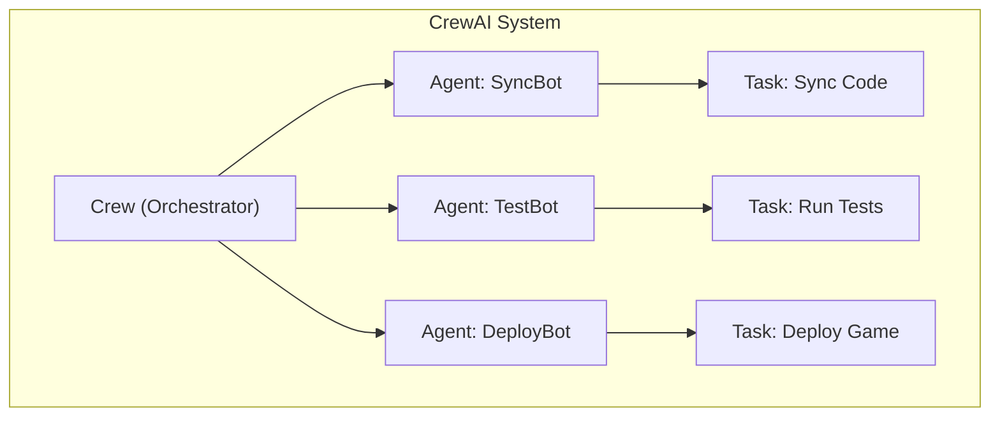

# CrewAI Architecture for Roblox Family Feud Automation

## Explanation
- **Agents**: Each agent is responsible for a specific automation role (e.g., syncing code, running tests, deploying).
- **Tasks**: Tasks are assigned to agents and define the work to be done.
- **Crew**: The Crew object orchestrates the workflow, assigning tasks to agents and managing execution order.

This modular design allows you to add, remove, or modify agents and tasks as your automation needs evolve. 